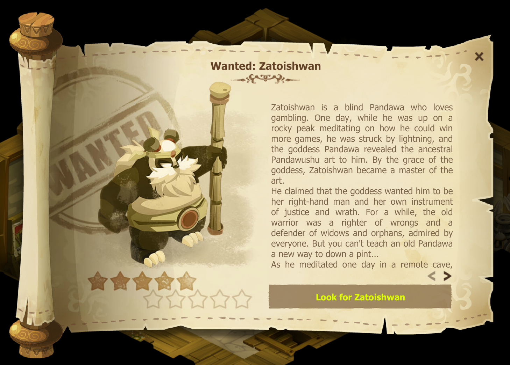

This guide is a work in progress, and I'm expanding it bit by bit. Feel free to [let me know](https://github.com/EmilyDimpfl/dofus-strats/issues) if there are things you'd like to see!

# Getting started in Dofus

I see a lot of questions about how to make money in Dofus, how to level, and general confusion about how to approach the game. I figured I'd take a crack at writing something up that could be helpful to new and older players alike.

Keep in mind that more or less whatever you do has value! Some things are obviously more valuable than others, and paying or trading players for items and help can be a great trade. You can often avoid doing things that you don't want to by just doing something else, and trading for the thing that you want.

## General Tips

I recommend starting with Incarnam quests and then moving to Astrub, and doing all the Astrub quests. This will be a good chunk of levels and a surprising amount of kamas that you'll be able to use to afford new gear, zaap fees, etc. You can find the quests you need in the `Quests > Astrub` section of the Achievements interface.

Keep in mind that on older servers, low level materials remain in-demand (due to high level players starting new characters, leveling new professions, and so on), so don't consider this wasted time!

I recommend taking the extra time to gather materials (trees, ore, and so on) when you pass by them, as the money you can make from selling them will be helpful, as well as being able to craft consumables to heal yourself between fights. There are quite a few quests later in the game that will require certain professions to be at least a certain level (more on this later)

If you have friends who already play, or have joined a guild, there's a good chance someone has extra healing potions/bread they can throw your way that they don't want (because they're leftover from leveling, too much of a hassle to try to sell, or whatever).

## Souling

Try to run the Kwakwa's Nest dungeon as soon as you can (or possibly have someone carry you through even if you're underleveled) - you get the Soul Capture spell by talking to the Bwak at the end.

Soul Capture allows you to capture monster souls that you can fight in the arena, and some quests require that you deliver specific souls. In particular, archmonsters are rare spawns that can take 8+ hours to respawn, and are required for the Ochre Dofus questline.

However, in order to soul an enemy, you have to equip a soulstone of equivalent or higher level in your weapon slot, in addition to casting the Soul Capture spell in combat. The Soul Capture spell gives your character a buff that lasts for 4 turns, and if the last monster dies while you have the soul capture "state" on your character with a soul stone equipped, you'll capture the monster's soul.

These soul stones can be quite expensive at higher levels, but archmonster souls often go for large sums, so keeping a few around while you're leveling allows you to make some money while you're running around stumbling across archmonsters. Souling dungeon bosses can also be a reliable source of income, as many boss souls are required for the [Eternal Harvest](https://dofuswiki.fandom.com/wiki/An_Eternal_Harvest#Step_17:_An_Eternal_Harvest) questline (steps 17-19).

I personally recommend not focusing on Ochre until you've gotten to level 200, have at least a beginner "endgame" set, and have built up some money. The number of soul stones you'll need is not small, and hunting and trading archmonsters is a lengthy process that you could put towards other more immediate improvements to your character.

More information: [https://dofuswiki.fandom.com/wiki/Soul_Stone](https://dofuswiki.fandom.com/wiki/Soul_Stone)

## Bounties and Scrolling

As you level, you may find rare mobs in various areas. There are quests to fight them available at militias around the world:

Talk to the boards to pick up each quest. They look like this:

A scroll will pop up on the screen - to accept the quest (if you're high enough level), click the bottom right button:

Note: on the island of Ohwymi, the bounty quests are in the tavern, rather than the militia.

More information: [https://dofuswiki.fandom.com/wiki/Bounty_Quest](https://dofuswiki.fandom.com/wiki/Soul_Stone)

## Professions

Its generally a good idea to level professions for the pods. Most crafting professions cost a pittance to level to level 50 or so on older servers, and having pods to carry stuff around with is extremely useful.

Leveling gathering professions is also really useful - it can be a nice boost to kamas while leveling (although the really valuable resources are going to be high level and fairly contested) and in the case of Hunter, Farmer, and Alchemist, it'll help subsidize your leveling with food to recover health between fights.

### Hunter

Hunter is great for passive income, and can help get you some food for leveling as well. It's the easiest profession to level, and as such it ends up being preferred by people who need a level 200 profession in order to progress with certain questlines (such as the Abyssal, or Cloudy Dofus questlines).

The main caveat is that you'll want to have a weapon with Hunter Weapon either on it naturally, or maged onto it. Thankfully, the mage is a pretty easy one, and there are a number of weapons you can find leveling with hunter weapon on it.

You'll also need some farmer and alchemy gathering materials in order to level hunter, but the quantity is fairly limited. I believe you'll need to craft about 170 of each food in order to level the 10 levels to the next tier.

### Farmer

Farmer is great for sticking your character in a field, shift-clicking a whole bunch of nodes, and getting a bunch of cereals relatively quickly. The return on cereals isn't incredible, and you'll run into other people doing the same, but it doesn't really require equipment and is easy.

### Alchemist

Alchemist is like farmer but with more babysitting, since there's more running between maps, the nodes are harder to click, there are fewer of them concentrated in small areas, and the return on time invested is so-so.

### Miner

*todo*

### Gear-crafting professions

*todo*

### Maging

*todo*

## Questing

There are a few things that you'll want to get for yourself that will come in handy from time to time:

* A [Rikiki Wand](https://www.dofus.com/en/mmorpg/encyclopedia/weapons/15990-rikiki-wand). It makes you smol, and you'll need one for a number of quests (even max level quests)!
* [Climbing Rope](https://www.dofus.com/en/mmorpg/encyclopedia/resources/9935-cuerda-escalada). It'll be needed for a bunch of the city questlines ("alignment quests") and a number of other quests here and there.
* Teleportation potions. You'll do a lot of traveling for quests, and being able to recall (especially in areas where you can't use your haven bag, like Cawwot Island and divine dimensions) can save a lot of time. I recommend stocking up on Recall Potions, and Bonta and Brakmar potions at the *very least*.

### "Main" Quests

In some games, it can be tempting to **only** do "main" quests. In Dofus, much of the time in order to complete quest achievements, you'll have to complete *all* quests from an area. These other quests also give kamas, experience, resources, and so on, making them a good way to advance your character.

Some quests will require you to bring resources or equipment to NPCs in order to progress, and can be a kama sink. Sometimes they're sidequests that are lower priority because they can be ignored since they don't block the other quests, but sometimes they're mandatory to progress in larger questlines and you'll just have to eat the costs to continue.

### Questing Profession Requirements

* 200 anything (Cloudy, Abyssal)
* 200 Farmer/Alchemist (Vulbis)
* 30 Carver (Several)
* 30 Handyman (Pandala)
* 20 Miner (Ebony)
* 20 Tailor
* 20 Smith (possibly not required)
* 10 Lumberjack (Ebony)
* 10 Artificer (Pandala)
* 10 Alchemist (Several)

# Common Scams and how to avoid them:

There are a few common scams that people have used over time. They're pretty easy to avoid if you know what you're doing and don't do certain things.

## "Link" Google Scams:
If someone whispers you asking to buy an item that you can't find in the ingame encyclopedia (especially if they ask you to google the item), that's almost certainly a scam.

Googling the item will usually have a scam domain (such as ankama-dofus.com) that looks similar to the Dofus homepage. It'll prompt you to enter your credentials (which you should absolutely not do!) - please report the account to Ankama support!

## RMT:

From what I understand, some RMT sites have asked for account credentials in the past. Don't give it to them! There's also no guarantee that you'll get the kamas you paid for, and if the account is busted by Ankama (and it's likely it'll get busted eventually) then they can find players that they traded with and ban them as well.

## Account Sharing:

Because gear largely isn't "soulbound" or linked to accounts in Dofus, the wealth you spend years accumulating can very easily simply be traded away to another account. Sharing your account with other players relies on a great deal of trust that they won't do that. That can be quite a bit of faith to place in another person, and many players who have shared their account information have logged in to find that all their stuff is gone, stolen by someone they trusted.

I recommend not sharing account credentials, and if you lend people gear, only lend what you can afford to potentially lose.

## Reporting scammers/bots to Ankama:

You need to send a mod (in the case of Echo, at the time of this writing, that's \[Mod]Fiora) an uncropped, unedited screenshot of the player in question (or whispers from them, in the case of link scammers and such) with the character information/details also visible in the chat box.

[https://ankabox.ankama.com/en/](https://ankabox.ankama.com/en/)

I understand that they also have a Twitter account that you can message now:

[https://twitter.com/dofusmods_en](https://twitter.com/dofusmods_en)

